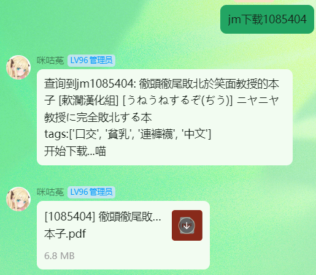

<div align="center">
    <a href="https://v2.nonebot.dev/store">
    </a>
</div>


<div align="center">

## ✨ *基于 Nonebot2 的 JMComic 插件* ✨

<a href="./LICENSE">
    
</a>
<a href="https://pypi.python.org/pypi/nonebot-plugin-jmdownloader">
    
</a>

<a href="https://github.com/astral-sh/ruff">
    
</a>
<a href="https://github.com/astral-sh/uv">
    
</a>
</div>

</div>

## 📖 介绍

JMComic搜索、下载插件，支持全局屏蔽jm号和tag，仅支持OnebotV11协议。


## 💿 安装

<details open>
<summary>使用 nb-cli 安装</summary>
在 NoneBot2 项目的根目录下打开命令行，输入以下指令即可安装

```bash
nb plugin install nonebot-plugin-jmdownloader --upgrade
```
使用 **pypi** 源安装

```bash
nb plugin install nonebot-plugin-jmdownloader --upgrade -i "https://pypi.org/simple"
```
使用**清华源**安装

```bash
nb plugin install nonebot-plugin-jmdownloader --upgrade -i "https://pypi.tuna.tsinghua.edu.cn/simple"
```
</details>

<details>
<summary>使用包管理器安装</summary>
在 NoneBot2 项目的插件目录下，打开命令行，根据你使用的包管理器，输入相应的安装命令

<details open>
<summary>uv</summary>

```bash
uv add nonebot-plugin-jmdownloader
```
安装仓库 master 分支

```bash
uv add git+https://github.com/Misty02600/nonebot-plugin-jmdownloader@master
```
</details>

<details>
<summary>pdm</summary>

```bash
pdm add nonebot-plugin-jmdownloader
```
安装仓库 master 分支

```bash
pdm add git+https://github.com/Misty02600/nonebot-plugin-jmdownloader@master
```
</details>

<details>
<summary>poetry</summary>

```bash
poetry add nonebot-plugin-jmdownloader
```
安装仓库 master 分支

```bash
poetry add git+https://github.com/Misty02600/nonebot-plugin-jmdownloader@master
```
</details>

打开 NoneBot2 项目根目录下的 `pyproject.toml` 文件，在 `[tool.nonebot]` 部分追加写入

```toml
plugins = ["nonebot_plugin_jmdownloader"]
```

</details>

## ⚙️ 配置

插件使用[nonebot_plugin_localstore](https://github.com/nonebot/plugin-localstore)储存数据和下载缓存。

在 NoneBot2 项目的`.env`文件中添加下表中的必填配置

| 配置项            | 必填  | 默认值 |             说明               |
| :---------------: | :---: | :----: | :----------------------------: |
| jmcomic_username  |  是   |   无   | JM登录用户名       |
| jmcomic_password  |  是   |   无   | JM登录密码         |
| jmcomic_proxies   |  否   | system | 网络代理地址                   |
| jmcomic_log       |  否   | False  | 是否开启JMComic-Crawler-Python的日志输出               |
| jmcomic_thread_count | 否 |   10   | 下载线程数量                   |
| jmcomic_allow_groups | 否 |   False   | 是否默认启用所有群                   |
| jmcomic_user_limits | 否 |   5   | 每位用户的每周下载限制次数                   |

**示例：**
```yaml
# 是否启用 JMComic 日志 (True 表示启用, False 表示禁用)
JMCOMIC_LOG=True
# JMComic 代理配置，更多格式参考https://jmcomic.readthedocs.io/zh-cn/latest/option_file_syntax
JMCOMIC_PROXIES=127.0.0.1:10809
# 下载线程数量 (线程越多对性能要求越高，范围 1~50)
JMCOMIC_THREAD_COUNT=10
# JMComic 登录用户名 (必填)
JMCOMIC_USERNAME=******
# JMComic 登录密码 (必填)
JMCOMIC_PASSWORD=******
# JMComic 是否默认启用所有群，建议关闭
JMCOMIC_ALLOW_GROUPS=False
# JMComic 每位用户的每周下载限制次数
JMCOMIC_USER_LIMITS=5
```

我的服务器为2核2G 4M，下载并发送10M的文件约需要1-2分钟

## 🎉 使用
### 指令表
|      指令      |     权限     | 需要@ |   范围   |                  说明                  |
| :------------: | :----------: | :---: | :------: | :------------------------------------: |
|   jm下载 [id]    |  群员  |  否   | 群聊/私聊| 下载指定的 JMComic 本子到群文件或私聊  |
|   jm查询 [id]    |  群员  |  否   | 群聊/私聊| 查询指定的 JMComic 本子信息及封面图   |
|  jm搜索 [关键词] |  群员  |  否   | 群聊/私聊| 搜索 JMComic 网站的漫画并返回列表     |
| jm拉黑 [@用户] | 管理员 | 否 | 群聊 | 将用户加入当前群的黑名单 |
| jm解除拉黑 [@用户] | 管理员 | 否 | 群聊 | 将用户移出当前群的黑名单 |
| jm黑名单 | 管理员 | 否 | 群聊 | 列出当前群的黑名单列表 |
| jm启用群 群号  |     超级用户     |  否   | 群聊/私聊| 启用指定群的插件功能                 |
| jm禁用群 群号  |     超级用户     |  否   | 群聊/私聊| 禁用指定群的插件功能                 |
| 开启jm         |     超级用户     |  否   | 群聊     | 启用本群的插件功能                   |
| 关闭jm         | 管理员 |  否   | 群聊     | 禁用本群的插件功能，管理员和群主**只能关不能开**                   |
| jm禁用id [id]   |     超级用户     |  否   | 群聊/私聊| 禁止指定jm号的本子下载，可用空格隔开多个id，以下同理          |
| jm禁用tag [tag]  |     超级用户     |  否   | 群聊/私聊| 禁止带有指定tag的本子下载 |


### 🎨 效果图




## ⚠️ 使用警告

**仅作为交流学习使用！请严格遵守法律法规与公序良俗！**

❌ 禁止将本插件用于任何非法用途
❌ 禁止分享/传播未成年人相关或违法内容
本插件仅限**个人合规使用**，用户行为责任自负，开发者不承担任何连带责任。

## 📃 许可证

本项目采用 [MIT](./LICENSE) 许可证。

## 🙏 致谢

[JMComic-Crawler-Python](https://github.com/hect0x7/JMComic-Crawler-Python)提供的API